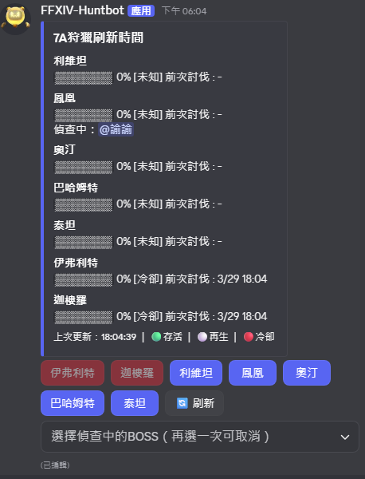
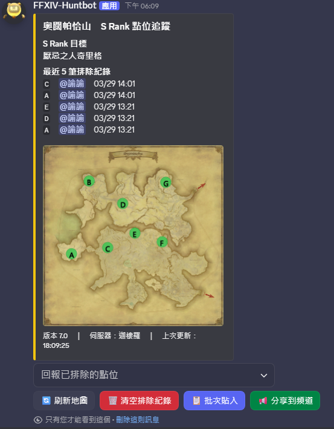
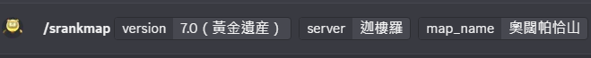

# FFXIVTC HuntingBot

> FINAL FANTASY XIV 台服狩獵輔助 Discord Bot  

---

## 功能一覽

| 指令 | 說明 | 限制 |
|---|---|---|
| `/set7atimerchannel` | 在目前頻道建立 7A 狩獵刷新時間追蹤面板 | 僅伺服器頻道，需權限 |
| `/resetboss` | 重置指定 BOSS 的討伐時間記錄 | 僅伺服器頻道，需權限 |
| `/srankmap` | 顯示指定地圖的 S Rank 點位追蹤（僅自己可見） | 伺服器 / 個人應用程式皆可 |

---
## 指令詳細說明

### `/set7atimerchannel`
在當前頻道建立 **7A 狩獵刷新時間追蹤面板**。



- 可以設置在某個頻道內，固定刷新(編輯)同一則訊息
- 面板每 5 分鐘自動刷新

**面板按鈕說明：**

| 按鈕 | 顏色 | 說明 |
|---|---|---|
| 各伺服器名稱 | 🟢 綠 | BOSS 存活（可討伐），點擊記錄討伐時間 |
| 各伺服器名稱 | ⚪ 灰 | BOSS 再生中（4～6h） |
| 各伺服器名稱 | 🔴 紅（禁用） | BOSS 冷卻中（0～4h） |
| 🔄 刷新 | 灰 | 手動刷新面板顯示 |
| 下拉選單 | — | 標記自己正在偵查中的 BOSS（再選一次取消） |

**BOSS 狀態時間軸：**
```
討伐後  0h ──── 4h（冷卻）──── 6h（再生）──── 存活 ──── 30h（重置為未知）
```

---

### `/srankmap`
顯示指定地圖的 **S Rank 點位追蹤地圖**（僅自己可見）。




- 參數：
  - `version`：遊戲版本（7.0 黃金遺産 / 6.0 曉月之終途）
  - `server`：遊戲伺服器（伊弗利特 / 迦樓羅 / 利維坦 / 鳳凰 / 奧汀 / 巴哈姆特 / 泰坦）
  - `map_name`：地圖名稱（支援自動補全）

**面板操作說明：**

| 按鈕 / 元件 | 說明 |
|---|---|
| 下拉選單 | 回報已排除的點位，即時更新地圖標記 |
| 🔄 刷新地圖 | 重新生成最新地圖圖片 |
| 🗑️ 清空排除紀錄 | 清除所有已排除點位，重新開始 |
| 📋 批次貼入 | 貼入「[繁中狩獵車](https://maluku1125.github.io/FFXIVHuntingTrain/)」或「Turtle Scouter」匯出格式，批次排除點位 |
| 📢 分享到頻道 | 將目前地圖圖片以公開訊息發送到當前頻道 |

**批次貼入支援格式：**
(支援 __烏龜網__ 與 __[繁中狩獵車](https://maluku1125.github.io/FFXIVHuntingTrain/)__ 的output直接貼上)
```
Queen hawk @ Urqopacha ( 18.8 , 14.0 )
Nechuciho @ Urqopacha ( 21.6 , 20.4 )
```
